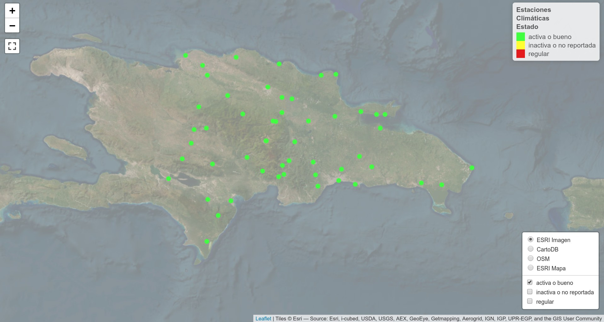
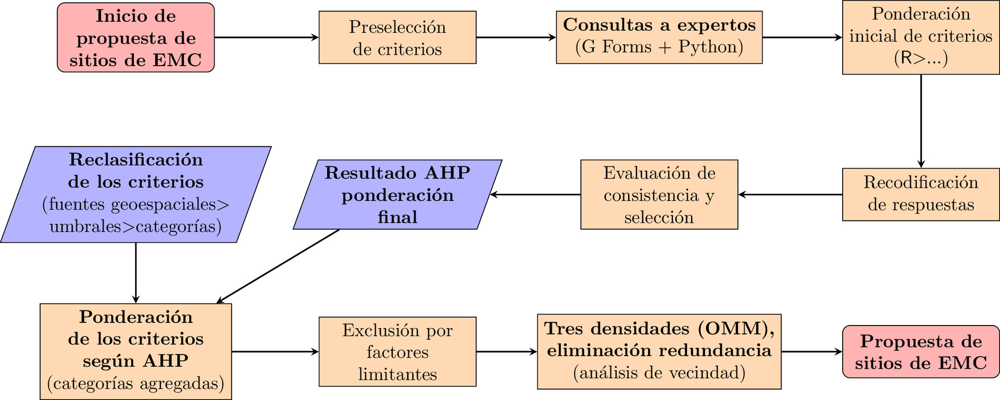
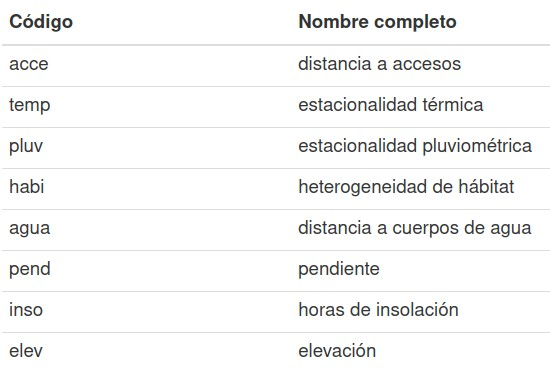
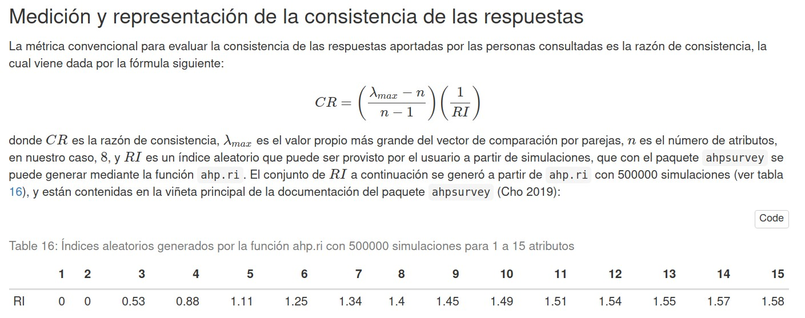
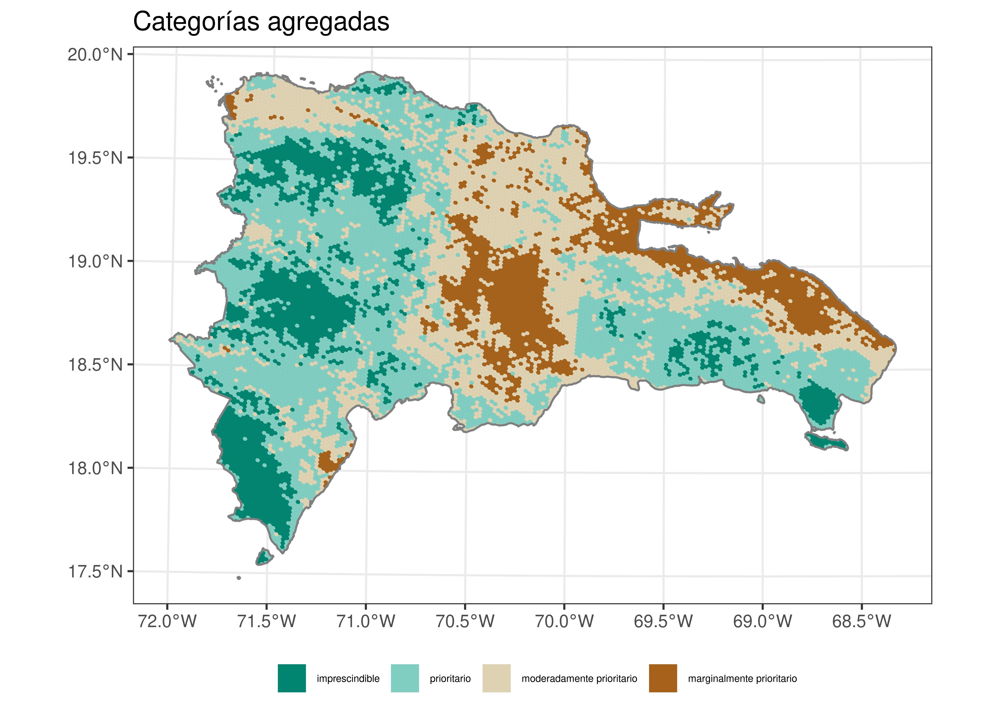

```{r setup, include=FALSE, echo=F}
knitr::opts_chunk$set(echo = FALSE)
ruta_figuras <- 'img/'
```

# OBJETIVOS

- Evaluar la cobertura espacial de estaciones meteoclimáticas en República Dominicana.  

- Aplicar AHP y análisis geoespacial para seleccionar sitios óptimos.  

- Diseñar una red eficiente, representativa y sin redundancias.  

# JUSTIFICACIÓN

## 

-   **Las estaciones meteoclimáticas (EMC) son vitales** para producir datos climáticos precisos y tienen aplicaciones en múltiples campos.

-   Los datos de las EMC, en sí mismos, no **previenen** impactos de fenómenos meteorológicos o del cambio climático, pero son una fuente esencial para apoyar **apoyan estudios meteorológicos climáticos**.

-   Una red adecuada de EMC es **crucial para la toma de decisiones** y **gestión del territorio**.

## 

-   Las EMC están **distribuidas desigualmente en el territorio** de República Dominicana, lo cual afecta la precisión y representatividad de los datos.

-   **Mejorar la red de EMC** es vital dada la **vulnerabilidad al cambio climático** de República Dominicana, para lo cual se requiere planificar la selección de sitios y, por supuesto, financiamiento.

## 

-   Los **métodos multicriterio de decisión** (MCDA y MCDM) son idóneos para el diseño de redes EMC, siempre que se usen **en combinación técnicas geoespaciales** (SIG, teledetección, análisis geoespacial, geomática).

-   El método "**proceso analítico jerárquico**" o "**proceso de jerarquía analítica**" (*analytic hierarchy process*), AHP, se ha aplicado con éxito en distintos contextos para seleccionar sitios óptimos de colocación de EMC.

## 

## 

## 

# MATERIALES Y MÉTODOS

```{bash, eval=F, include=F, echo=F}
cd img
ln -s ../../figuras/procesamiento-ahp-fuentes-sig-propuest-sitios.pdf .
convert -density 300 -background white -alpha remove -alpha off -resize 1920x \
  procesamiento-ahp-fuentes-sig-propuest-sitios.pdf \
  procesamiento-ahp-fuentes-sig-propuest-sitios.jpg
cd ..
```

## 

## 

## 

<small>Captura íntegra (ilegible por sus dimensiones) **de la tabla de resultados en bruto** (anonimizada) obtenida a partir del rellenado del "Formulario de comparación pareada de criterios de identificación de sitios idóneos para una red de observación climática"</small>

## 

## 

## 

## 

## 

## 

## 

<small>Resultado AHP: ponderación final (preferencias agregadas)</small>

## 

## 

## 

## {width="90%"}

## {width="90%"}

## 

## 

## 

# RESULTADOS

## 

<small>Sitios propuestos en el escenario de densidad **"una estación por cada 100 km**$^2$", dentro de las categorías "prioritario" e "imprescindible", **sin eliminar redundancia** respecto de estaciones existentes</small>

## 

<small>Sitios propuestos en el escenario de densidad **"una estación por cada 150 km**$^2$", dentro de las categorías "prioritario" e "imprescindible", **sin eliminar redundancia** respecto de estaciones existentes</small>

## 

<small>Sitios propuestos en el escenario de densidad **"una estación por cada 250 km**$^2$", dentro de las categorías "prioritario" e "imprescindible", **sin eliminar redundancia** respecto de estaciones existentes</small>

## 

<small>Sitios propuestos en el escenario de densidad **"una estación por cada 100 km**$^2$", dentro de las categorías "prioritario" e "imprescindible", **eliminando redundancia** respecto de estaciones existentes</small>

## 

<small>Sitios propuestos en el escenario de densidad **"una estación por cada 150 km**$^2$", dentro de las categorías "prioritario" e "imprescindible", **eliminando redundancia** respecto de estaciones existentes</small>

## 

<small>Sitios propuestos en el escenario de densidad **"una estación por cada 250 km**$^2$", dentro de las categorías "prioritario" e "imprescindible", **eliminando redundancia** respecto de estaciones existentes</small>

# DISCUSIÓN

## 

-   Se seleccionaron **sitios para estaciones meteoclimáticas**, maximizando recursos y eficiencia y evitando redundancia, aplicando **exitosamente AHP, técnicas geoespaciales y análisis de vecindad**.

-   Los criterios como **estacionalidad pluviométrica y térmica, horas de insolación, y elevación** fueron ponderados altamente en la selección de sitios, lo que refleja su importancia en la red meteoclimática.

-   El **uso de densidades**, siguiendo las recomendaciones de la Organización Meteorológica Mundial, ofrece la posibilidad de **mejorar la red en distintos escenarios**.

## 

-   Entre las limitaciones del estudio incluimos las siguientes:

    -   **Representatividad de la muestra** de expertos y expertas.

    -   **Representatividad de los criterios** seleccionados.

    -   **Escala** de la aplicación del AHP.

## 

-   Iniciativas futuras podrían centrarse en:

    -   Incluir **más variables**.

    -   Aplicar el mismo enfoque a **otros territorios caribeños**.

    -   **Desarrollar aplicaciones de usuario** que automaticen la mayor parte de los análisis.

## 

-   **El método AHP, conjuntamente con las técnicas geoespaciales y el análisis de vecindad, probaron ser útiles en la selección de sitios para estaciones meteoclimáticas, permitiendo una toma de decisiones informada y estratégica.**

# 

<section style="font-size: 72px; text-align: center;">

<br>

 jmartinez19\@uasd.edu.do

 geofis

</section>
